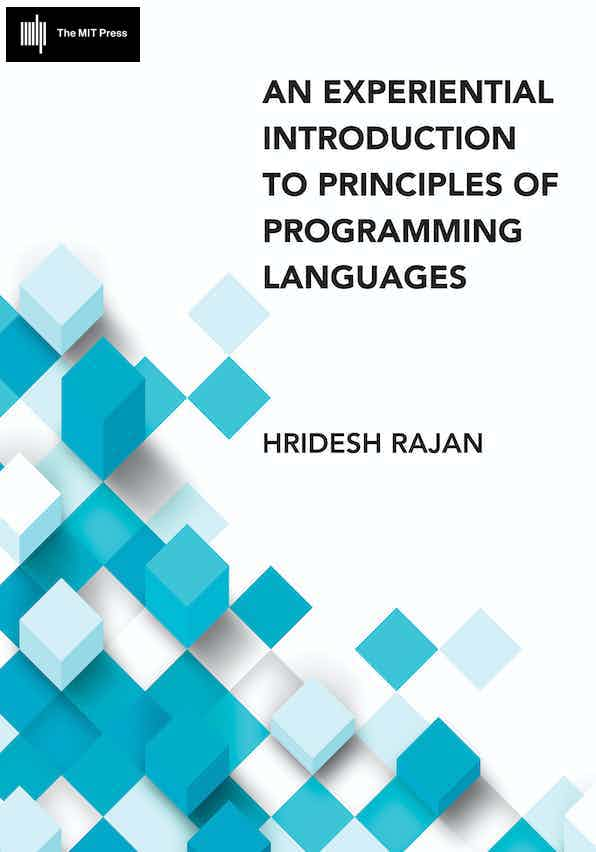

[{: style="float: right" width="250"}](https://mitpress.mit.edu/9780262045452/an-experiential-introduction-to-principles-of-programming-languages/)

Hridesh Rajan holds a Ph.D. and an MS in Computer Science from the [University of Virginia](https://virginia.edu).
He earned his B.Tech. in Computer Science and Engineering from 
the [Indian Institute of Technology, Varanasi](https://iitbhu.ac.in) (formerly IT-BHU).
Dr. Rajan currently serves as the Dean of the [School of Science and Engineering](https://sse.tulane.edu)
at [Tulane University](https://tulane.edu).
Prior to this role, he was the Kingland Professor and Chair
of [Computer Science](https://www.cs.iastate.edu)
at [Iowa State University](https://www.iastate.edu) from 2019 to 2024.
He also served as the founding Professor-in-charge of 
[Data Science Programs](https://datascience.iastate.edu) from 2017 to 2019.
During this period, he established the [annual Midwest Big Data Summer School](https://mbds.cs.iastate.edu) 
to deliver broadly accessible data science training,
served on the steering committee of the [Midwest Big Data Hub](https://midwestbigdatahub.org),
and led TADS ([Theoretical and Applied Data Science](https://tads.research.iastate.edu)), 
a cross-campus transdisciplinary research initiative of faculty and students interested 
in foundations and applications of Data Science.
From 2019 to 2024, Dr. Rajan was the Department Chair of Computer Science from 2019-2024, 
during which he oversaw significant growth in students, faculty, staff, and research funding.
His leadership in equity, diversity and inclusion led to the creation of a 
departmental broadening participation in computing plan and resulted
in a 45% increase in female enrollment.
Dr. Rajan also spearheaded the development of new academic programs including 
the [M.S. degree in Artificial Intelligence](https://www.cs.iastate.edu/ai), 
the [Data Science Minor, Certificate, and B.S. degree programs](https://datascience.iastate.edu),
the [B.A. degree in Computer Science](https://www.cs.iastate.edu/bachelor-arts-computer-science-approved-iowa-board-regents).
Rajan is a Fellow of the American Association for the Advancement of Science (AAAS)
and a Fulbright Scholar.
His research interests are in
Data Science, Software Engineering and Programming Languages 
where he is most known for his design of the 
[Ptolemy programming language](https://ptolemy.cs.iastate.edu) that 
showed how to modularly reason about crosscutting concerns and the 
[Boa programming language](https://boa.cs.iastate.edu) 
and its infrastructure that decreases the barriers to data-driven software engineering. 
He has been recognized by an NSF CAREER award (2009), 
by the LAS Early Achievement in Research Award (2010), 
a Big-12 Fellowship (2012), 
an ACM Senior Membership (2014), 
an exemplary mentor for Junior Faculty award (2017), 
a Kingland Endowed Professorship (2017), 
an ACM Distinguished Membership (2017), 
a US-UK Fulbright Scholarship (2018),
a Facebook Probability and Programming Award (2020), and 
an Early Achievement in Departmental Leadership Award (2022). 
He has served on the editorial boards of IEEE Transactions on Software Engineering and 
ACM SIGSOFT Software Engineering Notes, and currently serves on the advisory 
board of Proceedings of the ACM on Programming Languages and the steering committee of 
the [ACM SIGPLAN International Conference on Systems, Programming, Languages and Applications: Software for Humanity (SPLASH)](https://2024.splashcon.org). 
Earlier in his career, he worked as a Member of Technical Staff at Bell Labs,
Lucent Technologies in Bangalore, India, from 2000 to 2001.
Prof. Rajan was an [ABET](https://ABET.org/) program evaluator from 2018 to 2024 
and now serves as a commissioner for the [ABET Computing Accreditation Commission](https://www.abet.org/about-abet/governance/accreditation-commissions-2/).

### Short bio (for talks, etc.)

Hridesh Rajan currently serves as the Dean of the [School of Science and Engineering](https://sse.tulane.edu) at [Tulane University](https://tulane.edu). Prior to this role, he was the Kingland Professor and Chair of [Computer Science](https://www.cs.iastate.edu) at [Iowa State University](https://www.iastate.edu) from 2019 to 2024.  He also served as the founding Professor-in-charge of [Data Science Programs](https://datascience.iastate.edu) from 2017 to 2019. Prof. Rajan's research interests are in programming languages, software engineering, and data science where he is most known for his design of the Ptolemy programming language that showed how to modularly reason about crosscutting concerns and the Boa programming language and its infrastructure that decreases the barriers to data-driven software engineering. He has been recognized by the US National Science Foundation (NSF) with a CAREER award, an Early Achievement in Research Award, a Big-12 Fellowship, the Kingland Professorship, and an exemplary mentor for Junior Faculty award. Prof. Rajan is a AAAS Fellow, US-UK Fulbright scholar, distinguished member of the ACM. He has served on the editorial boards of IEEE Transactions on Software Engineering and ACM SIGSOFT Software Engineering Notes, and currently serves on the advisory board of Proceedings of the ACM on Programming Languages and the steering committee of the [ACM SIGPLAN International Conference on Systems, Programming, Languages and Applications: Software for Humanity (SPLASH)](https://2024.splashcon.org).

### Major Awards and Honors

- 2009 Early CAREER Award, US National Science Foundation
- 2010 Early Achievement in Research Award, College of Liberal Arts & Science, Iowa State University
- 2012 Big-12 Fellowship
- 2014 ACM Senior Member
- 2016-17 Emerging Leaders Academy. 
- 2016 Kingland Professorship. 
- 2016-17 Exemplary Mentor of Junior Faculty, Iowa State University. 
- 2017 ACM Distinguished Member.
- 2018 Fulbright US-UK Scholar.
- 2020 Facebook Probability and Programming Award
- 2020 ACM SIGSOFT Distinguished Paper Award at ESEC/FSE 2020
- 2021 AAAS Fellow 
- 2022 Early Achievement in Departmental Leadership Award
- 2023 ACM SIGSOFT Distinguished Paper Award at ASE 2023

### Former Graduate Students

- [Sumon Biswas](https://sumonbis.github.io) (PhD Spring'22, MS Fall'20), Assistant Professor at Case Western Reserve University
- [Shibbir Ahmed](https://shibbirtanvin.github.io) (PhD Spring'24, MS Summer'22), Assistant Professor at Texas State University
- [Giang Nguyen](https://www.linkedin.com/in/giang-nguyen-b6945914b/) (PhD Summer'24), Research Scientist at Meta
- [David O'Brien](https://www.linkedin.com/in/davidobr/) (PhD Summer'24), Research Scientist at Amazon AWS
- [Mohammad Wardat](https://scholar.google.com/citations?user=04sYwigAAAAJ&hl=ar) (PhD Summer'23), Assistant Professor at Oakland University
- [Rangeet Pan](https://rangeetpan.github.io) (PhD Summer'22), Research Staff Member at IBM T.J. Watson Research Center
- [Samantha Khairunnessa](https://www.linkedin.com/in/samantha-syeda/) (PhD Summer'21, MS Fall'17), Assistant Professor at Florida Gulf Coast University
- [Hamid Bagheri](https://www.linkedin.com/in/hamidbagheri/) (PhD Summer'20, MS Fall'19), Data Scientist at John Deere
- [Md. Johirul Islam](https://www.linkedin.com/in/johir/) (PhD Summer'20, MS Fall'19), Amazon R&D
- [Ganesha Upadhyaya](https://www.linkedin.com/in/gupadhyaya/) (PhD Fall'17, MS Spring'15), Harmony.One R&D
- [Mehdi Bagherzadeh](https://mbagherz.bitbucket.io) (PhD Summer'16, MS Fall'10), Associate Professor at Oakland University
- [Yuheng Long](https://www.linkedin.com/in/yuheng-long-073b4714/) (PhD Spring'16, MS Spring'10), Meta
- [Robert Dyer](https://cse.unl.edu/~rdyer/) (PhD Fall'13, MS Fall'08), Assistant Professor at the University of Nebraska, Lincoln
- [Tyler Sondag](https://www.linkedin.com/in/tyler-sondag-92b757b/) (PhD Fall'11, MS Fall'09), Principal Architect - CPU, NVIDIA 
- Ramanathan Ramu (MS Fall'17), Microsoft
- Nitin M. Tiwari (MS Spring'17), SAP
- Sean L. Mooney (MS Summer'15), SourceAllies
- Harish Narayanappa (MS Spring'10), eBay
- Jaikishan Jalan (MS Fall'09), Squad
- Youssef W. Hanna (MS Fall'08), Google
- Rakesh Setty (MS Fall'08), eBay
- Mahantesh Hosamani (MS Fall'07), Ericsson

### Academic Geneology

My advisor at University of Virginia was Kevin Sullivan, 
whose advisor was David Notkin. 
My academic genealogy goes all the way to Edsger Dijkstra.

In prior life, I worked at Bell Labs India, the R&D organization of Lucent Technologies. At the time, I was interested in bandwidth and power optimization issues in mobile ad hoc & sensor networks as they scale up. I still keep up with these topics.

### Contact me

You can contact me using either of the e-mail addresses below. 
When writing, please substitute firstname with hridesh.

* Work: [firstname@iastate.edu](mailto:firstname@iastate.edu)
* Personal: [firstname@gmail.com](mailto:firstname@gmail.com)

